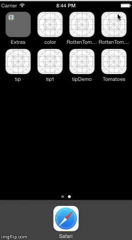

RottenTomatoes
==============

An app using Rotten Tomatoes data in Swift
<ul>
<li>
  User can view a list of movies from Rotten Tomatoes. Poster images must be loading asynchronously.
</li>
<li>User can view movie details by tapping on a cell</li>
<li>User sees loading state while waiting for movies API.</li>
<li>User sees error message when there's a networking error using a custom label.</li>
<li>User can pull to refresh the movie list.</li>
<li>
  Add a tab bar for Box Office and DVD (optional).
</li>
</ul>
+
+

